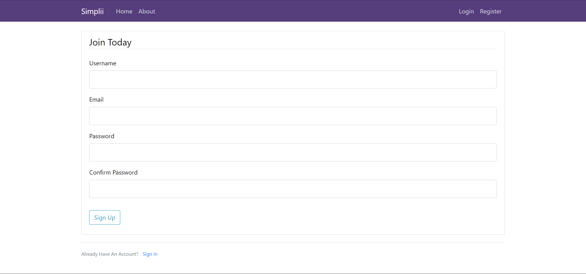
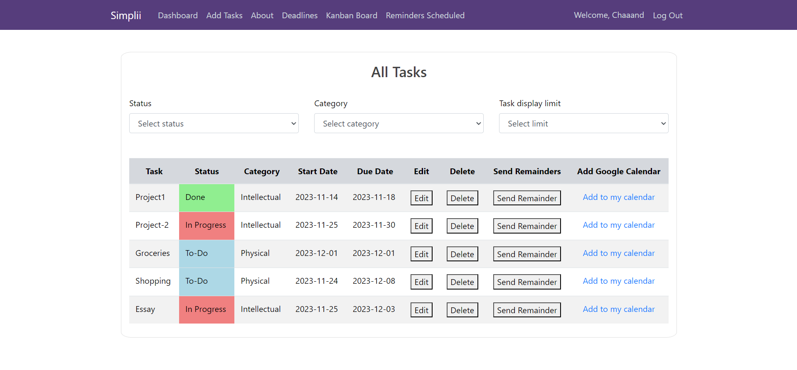
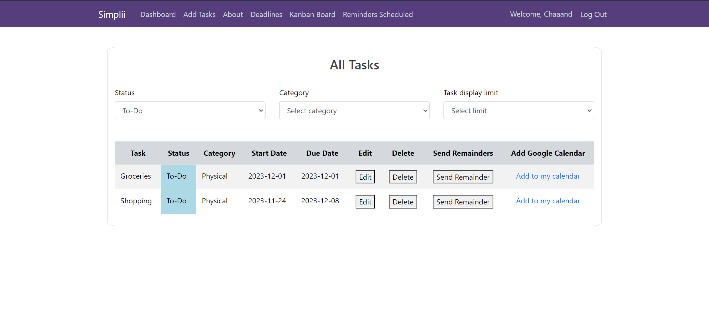
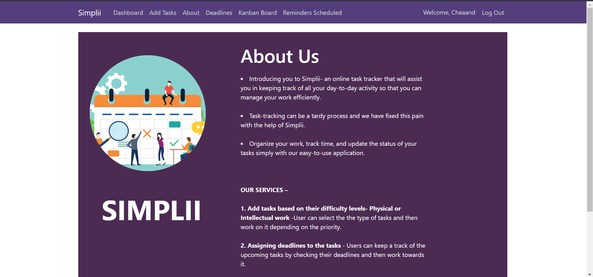
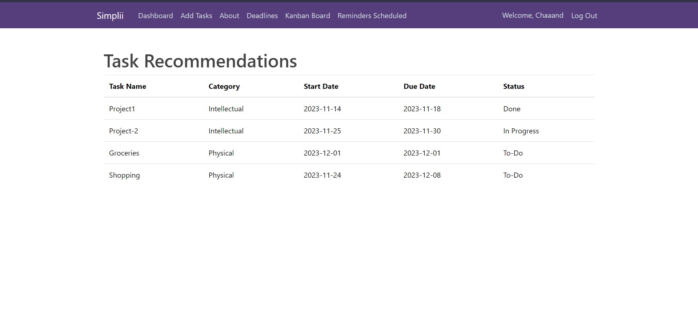
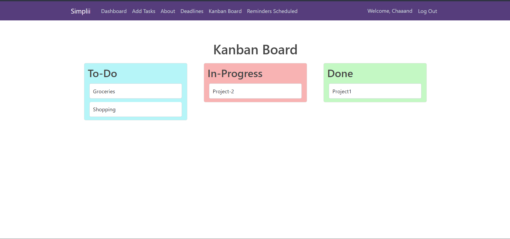
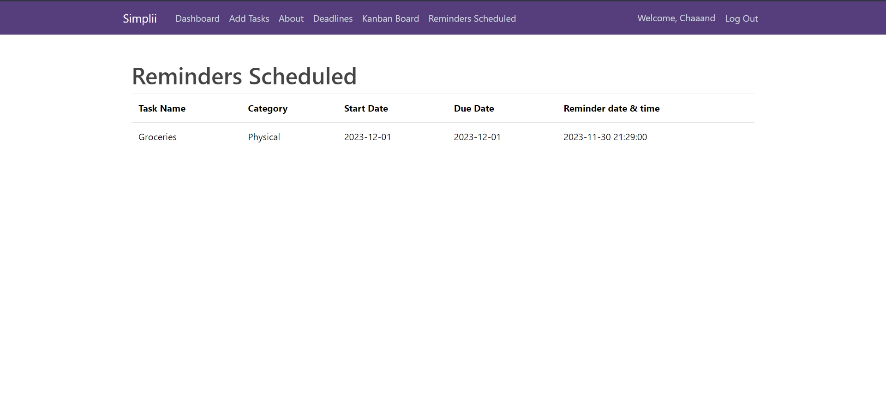
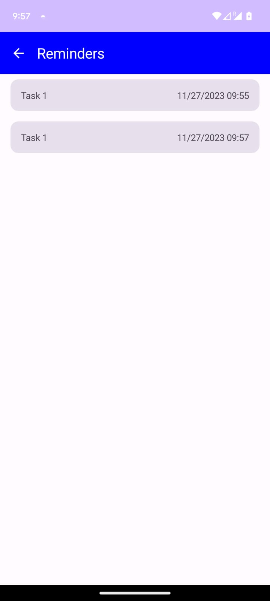

# Simplii - Task Management Web and Android Application

# Simplii 5.0

<h3>Are you trying to manage tasks? Simplii keep track of them, with all new Simplii 5.0!!! </h3>

Simplii is a versatile task management application available on both web and Android platforms. It offers a seamless experience for managing tasks efficiently.

# App Hosting

App hosted at [152.7.179.58:8080](http://152.7.176.58:8080/)

## Link to Demonstration Video of the Project: 

<a href="https://www.youtube.com/watch?v=PZtG0tiJfAg" target="blank">https://www.youtube.com/watch?v=PZtG0tiJfAg</a>

# Table of Contents  

- [Why Simplii?](#why-simplii)
- [Use Case](#use-case)
- [Built with:](#built-with)
- [Enhancements](#enhancements)
  - [Register](#register)
  - [Welcome Email](#welcome-email)
  - [Login](#login)
  - [Dashboard](#dashboard)
  - [Dashbord Filters](#dashboard-filters)
  - [About Page](#about-page)
  - [Add Task Page](#add-task-page)
  - [Edit Task Page](#edit-task-page)
  - [Deadlines](#deadlines)
  - [Kanban Board](#kanban-board)
  - [Reminder Schedule](#reminder-schedule)
  - [MongoDB Users Table](#mongodb-users-table)
  - [MongoDB Tasks Table](#mongodb-tasks-table)
  - [MongoDB Reminders Table](#mongodb-reminders-table)
- [Steps for Execution:](#steps-for-execution)
- [Source Code](#source-code)
- [Delta](#delta)
- [Future Scope](#future-scope)
- [Team Members](#team-members)
- [Contribution](#contribution)
- [License](#license)

## Why Simplii?

-Simplii has a user-friendly UI, equally appealing to people of all ages and also people learning to use technology.
-Multi-User Login
-User can add new tasks based on their category. 
-Users can update tasks as and when they work on them. 
-User can keep track of not just work that is in progress, but also completed tasks. 
-Tasks can be viewed based on the priority of the deadline. 
-Users can set up email reminders when a task approaches a deadline. 
-A kanban board type of view for easy tasks status visualization. 
-Users can set reminders of important tasks and plan accordingly.

## Use Case

-All people who love to multi-task their way through life would love Simplii as it helps them keep track of various tasks in the most simple manner.
-Anyone who is new to technology and would be overwhelmed by amazing and well-developed organising applications like google calender/apple calander, would love Simplii.
-Anyone with a need to keep up with the day-to-day tasks and wants to manage them effectively.

## Built with:

- Python
- JavaScript
- HTML5
- CSS3
- Bootstrap
- Flask
- MongoDB
- Android Studio
- Firebase

## Enhancements

### User Interface Register 

 You can create your own account and register on the website. You can store your data and can access the data whenever required. 

 ### Welcome Email 

 Once your register for Simplii, you get a welcome email from us appreciating your interest in using our website and welcoming you onboard. 

 
### User Interface Login 

 Once you create an account, you can login to the website using your credentials 

 
### Dashboard

 Once you login, you see your dashboard 

### Dashboard Filters

 Dashboard's tasks listed can be filtered and viewed as per the user requirements. 

### User Interface About Page

 When you click on the about on the navigation bar, you are redicrected to a page that consists information about Simplii 

### Add Task Page

 When you click on the add task on the navigation bar, you are redicrected to a page that consists of a form. Here, you can fill the details regarding the task you want to add and click on add task. The task is added to the database and you can view it on the dashboard 

### Edit Task Page

 When you view the task on the dashboard, you can see the option to edit the task details. When you click on edit, the edit task form opens up and you can make necessary changes to the task details and update them. 

### Deadlines

 When you click on the deadline tab on the navigation bar, you are redirected to the deadlines page. This page consists of all your tasks in the order of earliest due to the farthest due. In this page you can also choose a date and get an email regarding the tasks that are due within the date chosen. 

### Kanban Board

 Categorize tasks into swimlanes based on different criteria like team, priority, or project phase. Enable users to define their own task workflow stages. 

### Reminders Scheduled

 Can schedule the reminder to be set on a particular date and time and shows in its own reminders scheduled page 

### MongoDB Users Table

 For Simplii we used MongoDB for backend. The following image shows how the users details are stored in the database.

### MongoDB Tasks Table

 For each user, we store their tasks in the database. The following image shows how the tasks are stored in the database. 

### MongoDB Reminders Table

 For each user, we store their task's reminder as a table in the database. The following image shows how the reminders scheduled as stored in the database. 

### Android App Tasks 

 The woking of the whole Android Simplii app

https://github.com/SaikrishnaRajaraman/Simplii/assets/88961569/30a98409-fdc3-4a8a-a615-30d45000b1d2
 

 Reminders are scheduled and can be seen. 

 

 Receives app notifictions too. 

 

 The working of the Tudum - Smart Assistant

https://github.com/SaikrishnaRajaraman/Simplii/assets/88961569/bb179a18-e63e-47b8-827e-698ba0518241
 

### API documentation
<a href="https://documenter.getpostman.com/view/30668487/2s9YeEcsTd">API docs</a>
 

## Steps for execution of Web-app
 
 Step 1:
 Install MongoDB using the following link:
 
 https://docs.mongodb.com/manual/tutorial/install-mongodb-on-windows
 
 Step 2: 
  Git Clone the Repository 
  
    git clone https://github.com/SaikrishnaRajaraman/Simplii.git
    
  (OR) Download the .zip file on your local machine
  
    https://github.com/SaikrishnaRajaraman/Simplii.git
  
 Step 3:
   Install the required packages by running the following command in the terminal 
   
    pip install -r requirements.txt
    
 Step 4:
    Run the following command in the terminal
    
    python src/application.py
    
 Step 5:
    Open the URL in your browser:  
      http://127.0.0.1:5000/

## Steps for execution of Chrome extension

 Step 1:
 Open web browser and go to the following link:
 
     chrome://extensions/

 Step 2: 
  Trun on the developer mode on top right corner and click on "Load unpacked" button on top left corner. Upload the <a href="https://github.com/SaikrishnaRajaraman/Simplii/tree/main/src/Simplii_chrome_extension"> Simplii_chrome_extension </a> from your cloned repository in the local disk.
  
  
 Step 3:
   Extension is succefully added and you can access it by the extensions icon on top-right corner on the browser webpage. 

            https://github.com/SaikrishnaRajaraman/Simplii/assets/88961569/61bd2fc5-4b90-4000-a84d-c21a4783a450

  

                                                                                                                                      

  ## Delta
 
 <b> a) Android App development: </b> Developed an Android app with same functionalities.
 
 <b> b) Reminder Schedule: </b> Provided each task with a remider schedule option where the user can set the remider date and time.
    
 <b> c) Kanban Board: </b> Added kanban board like functionality to organize the tasks based on Status.

 <b> d) Syncing task to Google calender: </b> Set a button to add the particular task to your Google Canlender.

 <b> e) Tudum - Smart Assistant: </b> Integrated with openAI to provide result based on user query which can be directly added to the Task board or To-Do list if needed. Implemented in the Android app.

 <b> f) Hosted on VCL: </b> The application is hosted on NCSU VCL.

 <b> g) Improved sort filters: </b> User is now able to sort tasks based on caterogy, status and manage the number of tasks shown.

 <b> h) Chrome extension: </b> Developed a Chrome extension to store the tasks and deleted it when completed. Made use of localstorage to store the tasks here.
        
   ## Third party dependencies

   1. OpenAI
   2. Firebase
   3. MongoDB
  
   ## Future Scope
  
  The  following features can be implemented in the future scope of this application:
 
  1. The Tudum Smart assistant can be implemented in the web application.
  2. Improve the parsing of openAI.
  3. Imrpove the chrome extension by saving tasks into database tasks list so that it can be access realtime by webpage/app.

   
   ## Team Members
   
  <ul style="list-style-type:  '- ' ; padding: 0;">
  <li>Chandana Mallu (cmallu)</li>
  <li>Saikrishna Rajaraman (srajara4)</li>
  <li>Sidharth Anand (sanand8)</li>
  <li>Tripurashree Mysore Manjunatha (tmysore)</li>
</ul>

  ## Contribution
  
  Please refer the CONTRIBUTING.md file for instructions on how to contribute to our repository.

  ## License
  
  This project is licensed under the MIT License.
  
                                                                                                                                                   
                                                                                                                                                   
                                                                                                                                                   
                                                                                                                                                   
                                                                                                                                                   
                                                                                                                                                   
                                                                                                                                                   
                                                                                                                                                   
                                                                                                                                                   
                                                                                                                                                   
                                                                                                                                                   
                                                                                                                                                   
                                                                                                                                                   
                                                                                                                                                   
  
  

      
 
 
 
 
 
 
 
 
 
 
 
 

