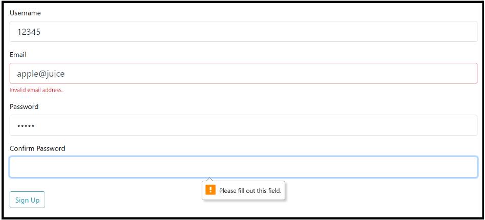
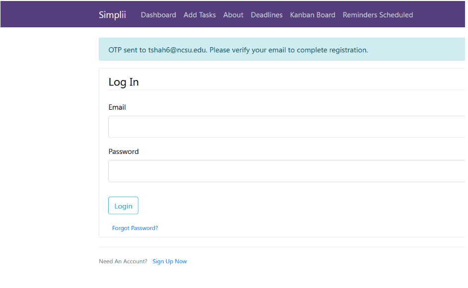
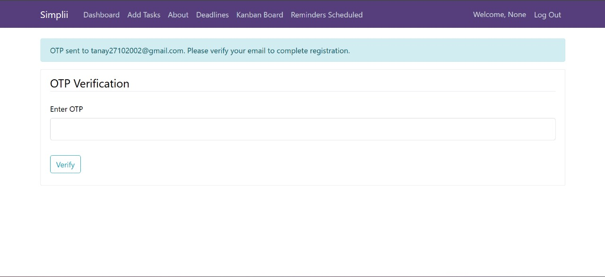
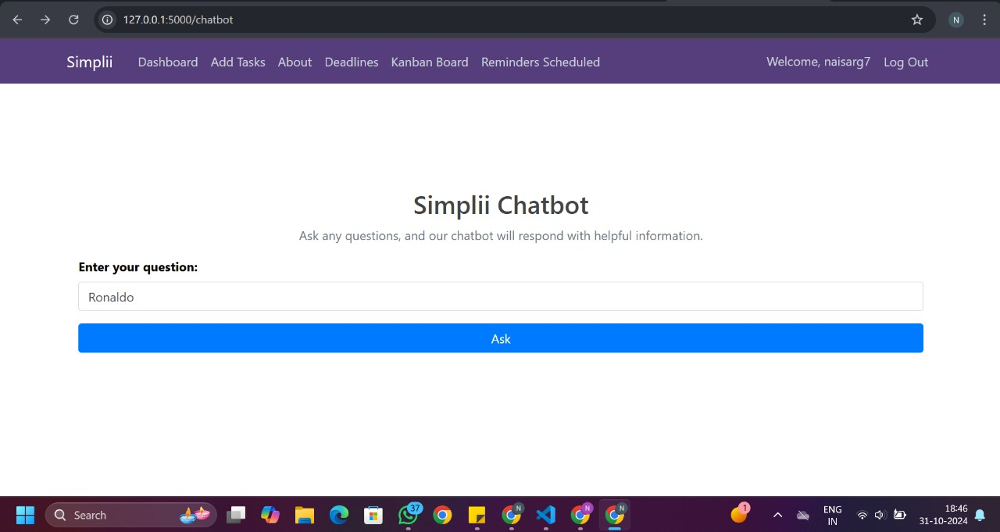

# Simplii - Task Management Web and Android Application

# Simplii 5.0

<h3>Are you trying to manage tasks? Simplii keep track of them, with all new Simplii 5.0!!! </h3>

Simplii is a versatile task management application available on both web and Android platforms. It offers a seamless experience for managing tasks efficiently.

# App Hosting

## Link to Demonstration Video of the Project: 

# Table of Contents  

- [Why Simplii?](#why-simplii)
- [Use Case](#use-case)
- [Built with:](#built-with)
- [Enhancements](#enhancements)
  - [Register](#register)
  - [Welcome Email](#welcome-email)
  - [Login](#login)
  - [Dashboard](#dashboard)
  - [Dashbord Filters](#dashboard-filters)
  - [About Page](#about-page)
  - [Add Task Page](#add-task-page)
  - [Edit Task Page](#edit-task-page)
  - [Deadlines](#deadlines)
  - [Kanban Board](#kanban-board)
  - [Reminder Schedule](#reminder-schedule)
  - [MongoDB Users Table](#mongodb-users-table)
  - [MongoDB Tasks Table](#mongodb-tasks-table)
  - [MongoDB Reminders Table](#mongodb-reminders-table)
- [Steps for Execution:](#steps-for-execution)
- [Source Code](#source-code)
- [Delta](#delta)
- [Future Scope](#future-scope)
- [Team Members](#team-members)
- [Contribution](#contribution)
- [License](#license)

## Why Simplii?

- Simplii has a user-friendly UI, equally appealing to people of all ages and also people learning to use technology.
- Multi-User Login
- User can add new tasks based on their category. 
- Users can update tasks as and when they work on them. 
- User can keep track of not just work that is in progress, but also completed tasks. 
- Tasks can be viewed based on the priority of the deadline. 
- Users can set up email reminders when a task approaches a deadline. 
- A kanban board type of view for easy tasks status visualization. 
- Users can set reminders of important tasks and plan accordingly.

## Use Case

- All people who love to multi-task their way through life would love Simplii as it helps them keep track of various tasks in the most simple manner.
- Anyone who is new to technology and would be overwhelmed by amazing and well-developed organizing applications like Google Calendar/Apple Calendar would love Simplii.
- Anyone with a need to keep up with the day-to-day tasks and wants to manage them effectively.

## Built with:

- Python
- JavaScript
- HTML5
- CSS3
- Bootstrap
- Flask
- MongoDB
- Android Studio
- Firebase

## Features

### User Interface Register 

 You can create your own account and register on the website. You can store your data and can access the data whenever required. 

### Welcome Email 

 Once your register for Simplii, you get a welcome email from us appreciating your interest in using our website and welcoming you onboard. 

### Email Verification using Regex

Check if the Email is valid or not.

### OTP verification

OTP is sent to the email ID of the User trying to login and it is verified.

 
### User Interface Login 

 Once you create an account, you can login to the website using your credentials 

 
### Dashboard

 Once you login, you see your dashboard 

### Dashboard Filters

 Dashboard's tasks listed can be filtered and viewed as per the user requirements. 

### User Interface About Page

 When you click on the about on the navigation bar, you are redirected to a page that consists information about Simplii 

### Add Task Page

 When you click on the add task on the navigation bar, you are redirected to a page that consists of a form. Here, you can fill the details regarding the task you want to add and click on add task. The task is added to the database and you can view it on the dashboard 

### Edit Task Page

 When you view the task on the dashboard, you can see the option to edit the task details. When you click on edit, the edit task form opens up and you can make necessary changes to the task details and update them. 

### Chatbot Integrated

Chatbot is implemented as a new feature which will guide to manage your task and assist you with any queries related to the chatbot

### Deadlines

 When you click on the deadline tab on the navigation bar, you are redirected to the deadlines page. This page consists of all your tasks in the order of

 deadlines. The deadlines are categorized based on the priority as 1 day left, 3 days left, 5 days left and overdue. When the task is overdue, it is highlighted in red and a mail is sent to the user notifying that the deadline for a particular task is done. 

### Kanban Board

 Tasks are also organized in kanban board type of view to help users visualize the status of the task easily. 

### Reminder Schedule

 Reminders are scheduled to notify the user when a task deadline is approaching. Users can schedule reminders from the dashboard. 

<!-- 

 -->

## Enhancements
### Dark Mode

 Added persistant dark and light themes to the application.  
  
* _Light Theme Application SS:_
  

* _Dark Theme Application SS:_

### AI Email Schedule and Tasks

* Loading animation while sending email.

* Acknowledgement for email send.

* Example email synthesized using AI

### Export tasks to .csv file

* Users can export current tasks to a csv file and download

### MongoDB Users Table

 Users details are saved in the database. User's data is protected.

### MongoDB Tasks Table

 Tasks related data of each user is stored in the MongoDB tasks table.

### MongoDB Reminders Table

 Reminders are stored and managed in the MongoDB reminders table.

## Steps for Execution:

1. Clone the repository: `git clone https://github.com/aayushbrahmbhatt/Simplii.git`
2. Install the necessary dependencies: `pip install -r requirements.txt`
3. Run the application: `python app.py`

## Delta

- **Added Dark Mode**: Added persisting dark mode to the application. 
- **Export Task to .csv**: Users can export their tasks to a csv file
- **AI Schedule Email**: Receive email from AI to get a brief of your tasks and a schedule. 

## Future Scope

1. Add AI-driven task prioritization.
2. Integrate with other calendars like Google Calendar.
3. Add dark mode for the mobile application.
4. Improve notifications for the mobile application.

## Team Members

- **Anurag Gorkar** - AnuragGorkar
- **Aryan Iguva** - aryansharma2k2
- **Harsh Vora** - harshvora7

## Contribution

Contributions are welcome! Please open an issue or submit a pull request.

## License

This project is licensed under the MIT License - see the [LICENSE](LICENSE) file for details.
